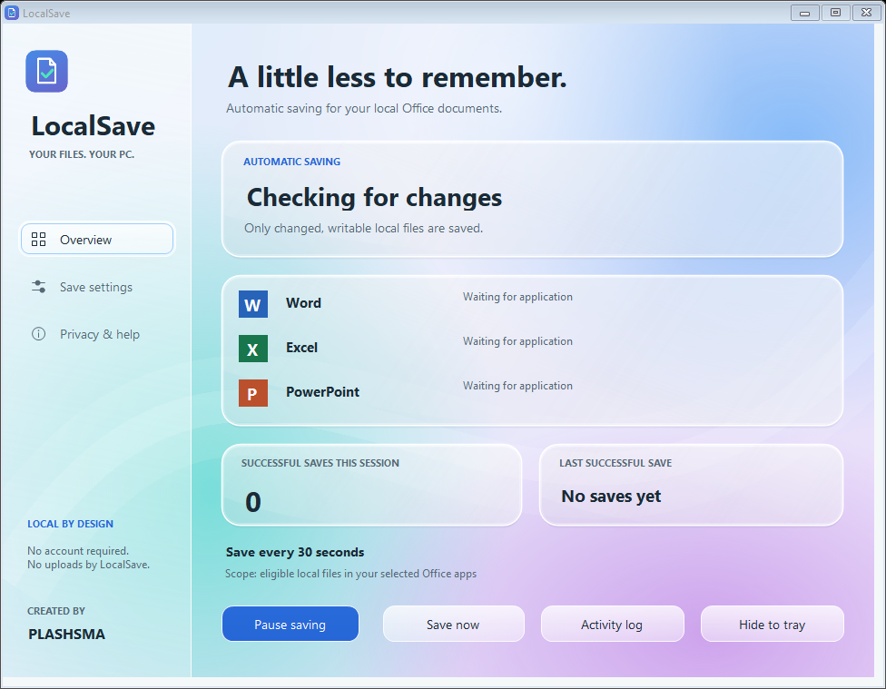

# LocalSave

**Local automatic saving for desktop Word, Excel and PowerPoint.**

Created by **PLASHSMA**. A portable Windows utility with a glass-style interface,
1-second minimum interval, and a mode that checks for changes about every 250 ms.
No OneDrive account is required by the helper.

**[Download v2.2.0 preview](https://github.com/plashsma/localsave/releases/tag/v2.2.0)**
· **[Step-by-step user guide](docs/USER_GUIDE.md)**
· **[Troubleshooting](docs/TROUBLESHOOTING.md)**

## Get started

1. Download **LocalSave-2.2.exe** from the release's **Assets** section.
2. Put it in a permanent folder on your Windows PC and run it.
3. Save each new Office file manually once to choose its name and location.
4. In **Save settings**, select your apps and saving mode, then **Apply settings**.
5. Optionally enable **Start LocalSave when I sign into Windows** and apply again.

Closing the window hides it to the tray. Use **Exit** from the tray menu to stop
saving. **Privacy & help → Uninstall / reset** removes startup, settings and logs;
you can then delete the portable EXE.

## Features

| Feature | Behavior |
| --- | --- |
| Interval mode | Checks changed local files every 1–3600 seconds |
| After changes | Checks about every 250 ms; saves when Office is ready |
| App selection | Choose Word, Excel, PowerPoint, or a combination |
| Folder restriction | Limit saves to a local folder and its subfolders |
| Excel discovery | Checks registered instances and Excel's desktop windows |
| Manual controls | Pause/resume, save now, activity viewer and tray menu |
| Local privacy | No networking, telemetry or keyboard recording in the helper |

## Requirements and limits

- Windows 10/11, .NET Framework 4.8+, and installed, activated desktop Office.
  Web Office, macOS and mobile devices are unsupported.
- A new file must be saved manually once. Read-only, network, web and redirected
  paths, Excel add-ins, and files already using native Office AutoSave are skipped.
- Excel cell edits must be committed with **Enter**, **Tab**, or by leaving the
  cell. This app cannot save every keystroke inside an uncommitted cell.
- Excel checks multiple desktop instances. Inaccessible instances may be missed;
  Word and PowerPoint use one registered instance per app.
- Busy Office apps or save dialogs can delay a cycle. One failed file does not
  prevent the helper from attempting other files it can access.
- This is periodic saving, not Microsoft's cloud AutoSave, collaboration or
  version history. Keep AutoRecover and backups enabled.

## Preview release status

Version **2.2.0 is a preview**. The 38 behavior/settings checks and 7 UI checks
passed locally using test doubles where Office was required. The interface was
rendered and inspected. A complete live Office test could not be performed in
the development environment; Excel's native window bridge still needs real-world
verification. Test disposable files before relying on this utility.

The EXE is **unsigned**. Downloading from GitHub does not give it a trusted
publisher signature or guarantee approval by Windows security software. See
[security and distribution](SECURITY.md). Do not disable protections to run it.

## Documentation

- [User guide: installation, modes, startup and uninstall](docs/USER_GUIDE.md)
- [Troubleshooting: Excel, busy apps and skipped files](docs/TROUBLESHOOTING.md)
- [Build and test from source](docs/BUILDING.md)
- [Publish a repository and release, step by step](docs/PUBLISHING.md)
- [Release history](CHANGELOG.md)
- [Contributing](CONTRIBUTING.md)

## License and credit

Created by **PLASHSMA**. No open-source license has been selected for this
repository yet. Public source availability should not be described as an MIT,
Apache or other licensed open-source release until the owner selects a license.
